**LAPORAN PERTEMUAN 3 - DART BAGIAN 2**

NAMA  : ANDREAS GALE DWI JAYA

KELAS : SIB - 3D

NIM   : 2241760033

**Praktikum 1: Menerapkan Control Flows ("if/else")**

Langkah 1

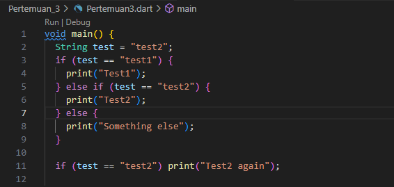

Langkah 2 : Silakan coba eksekusi (Run) kode pada langkah 1 tersebut. Apa yang terjadi? Jelaskan!

Jawab : Akan terjadi eror karena terdapat penulisan kata kunci if dan else yang salah. Seharusnya ditulis dengan huruf kecil semua.

Output Setelah di Perbaiki :

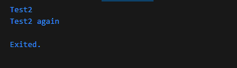

Penjelasan : Ketika kode Dart dijalankan, variabel `test` yang diinisialisasi dengan nilai `"test2"` pertama kali diperiksa dalam blok `if-else`. Karena kondisi pertama `if (test == "test1")` tidak terpenuhi, program melanjutkan ke kondisi kedua `else if (test == "test2")`, yang benar, sehingga mencetak `"Test2"`. Setelah itu, ada pemeriksaan kedua dengan kondisi `if (test == "test2")` yang juga benar, sehingga program mencetak `"Test2 again"`. Akhirnya, output yang dihasilkan adalah dua baris: `"Test2"` dan `"Test2 again"`.

Langkah 3 : Tambahkan kode program berikut, lalu coba eksekusi (Run) kode Anda.

    String test = "true";
    if (test) {
    print("Kebenaran");
    }

Apa yang terjadi ? Jika terjadi error, silakan perbaiki namun tetap menggunakan if/else.

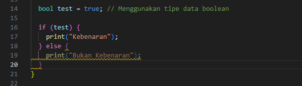

Output :

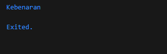

**Praktikum 2: Menerapkan Perulangan "while" dan "do-while"**

Langkah 1 : Ketik atau salin kode program berikut ke dalam fungsi main().

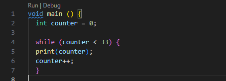

Langkah 2 : Silakan coba eksekusi (Run) kode pada langkah 1 tersebut. Apa yang terjadi? Jelaskan! Lalu perbaiki jika terjadi error.

Jawab : akan terjadi eror karena ada tipe data yang tidak sesuai yang seharusnya menggunakan tipe data boolean (true/false).

Output Setelah Diperbaiki :

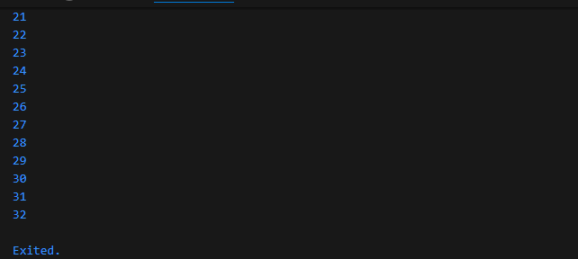

Langkah 3 : Tambahkan kode program berikut, lalu coba eksekusi (Run) kode Anda.

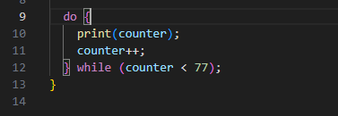

Output :

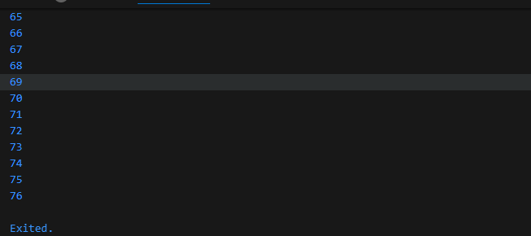

**Praktikum 3: Menerapkan Perulangan "for" dan "break-continue**

Langkah 1 : Ketik atau salin kode program berikut ke dalam fungsi main().

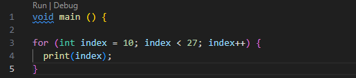

Langkah 2 : Silakan coba eksekusi (Run) kode pada langkah 1 tersebut. Apa yang terjadi? Jelaskan! Lalu perbaiki jika terjadi error.

Jawab : Akan terjadi eror karena belum ada variabel counter yang dideklarasikan. Didalam Dart, semua veriabel harus di deklarasian sebelum digunakan.

Output Setelah diperbaiki :

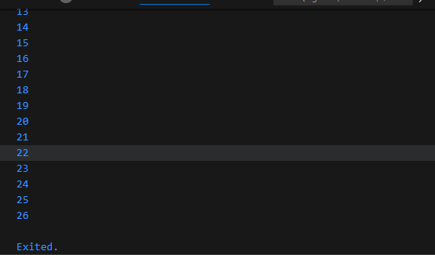

Langkah 3 : Tambahkan kode program berikut di dalam for-loop, lalu coba eksekusi (Run) kode Anda.

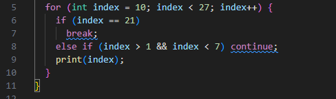

Apa yang terjadi ? Jika terjadi error, silakan perbaiki namun tetap menggunakan for dan break-continue.

Jawab : Akan terjadi eror karena belum ada variabel counter yang dideklarasikan. Didalam Dart, semua veriabel harus di deklarasian sebelum digunakan.

Output Setelah Diperbaiki :

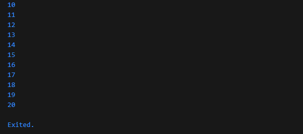

**TUGAS**

Buatlah sebuah program yang dapat menampilkan bilangan prima dari angka 0 sampai 201 menggunakan Dart. Ketika bilangan prima ditemukan, maka tampilkan nama lengkap dan NIM Anda.

Jawab : Bilangan prima dari 0 sampai 201 ada 46 bilangan. 
Kode Program :
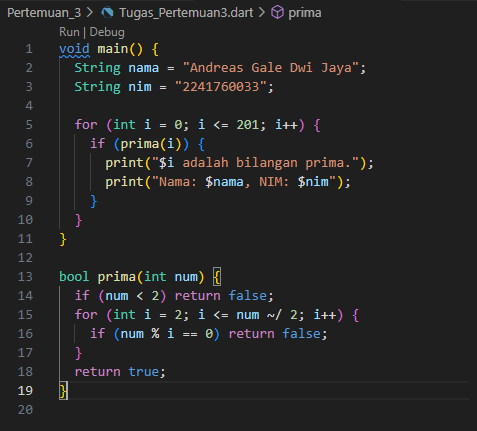

Output :

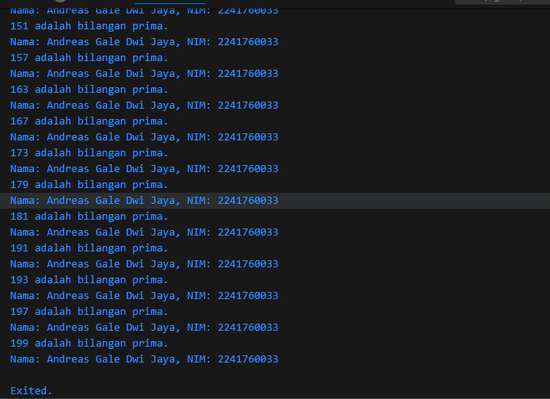

**CHALLENGE IPK CALCULATOR**

Kode Program :

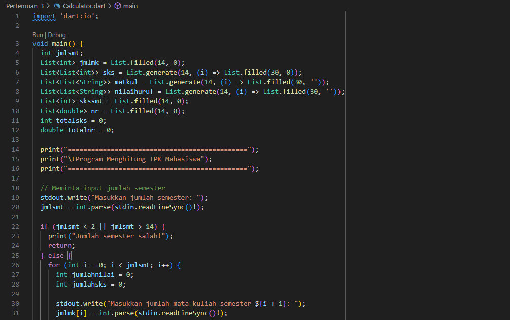
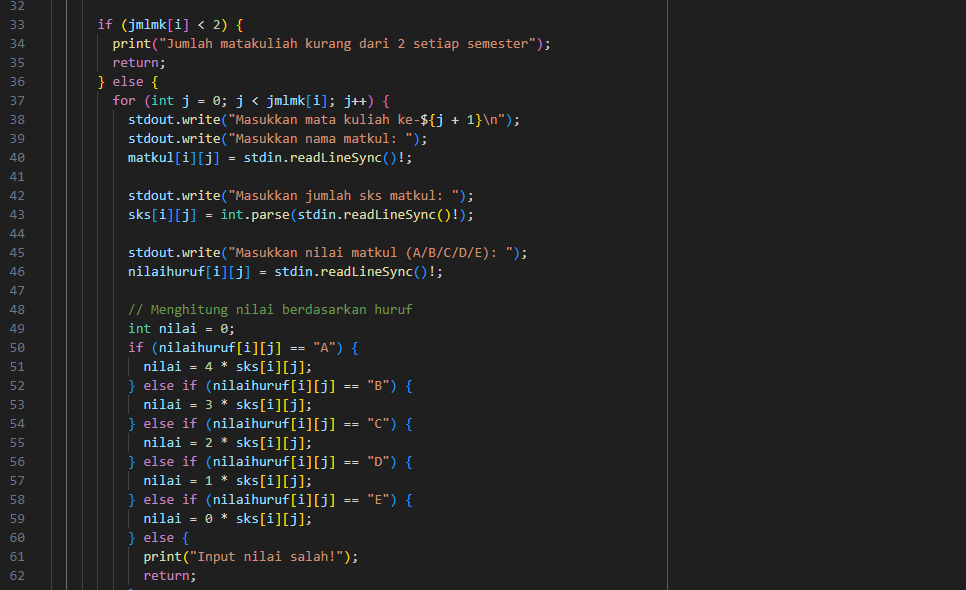
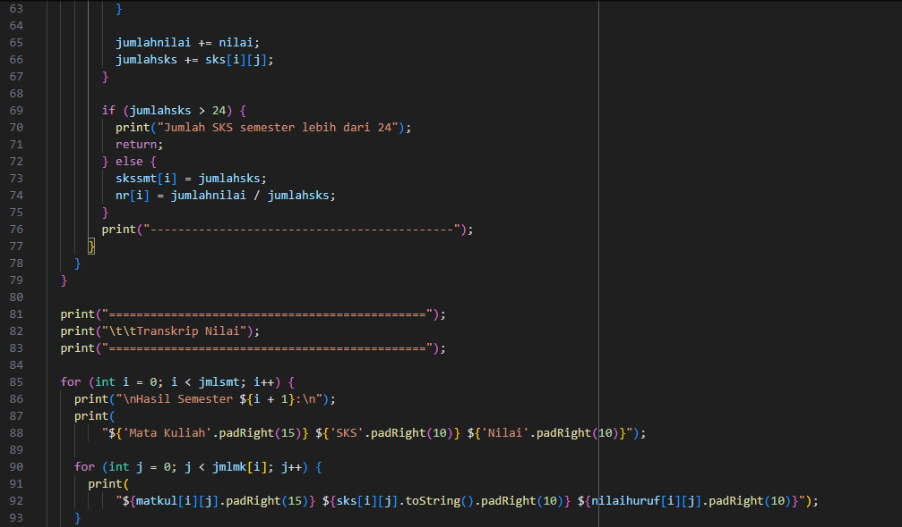
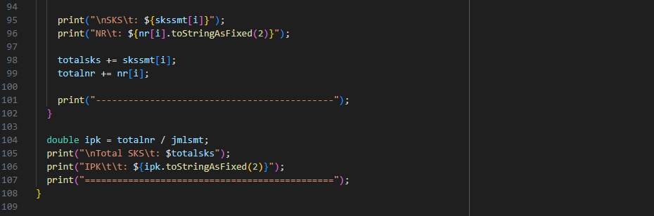

Output :

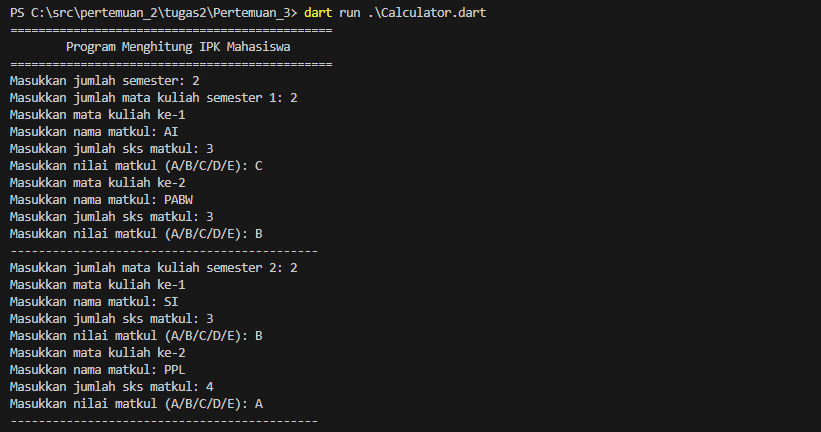
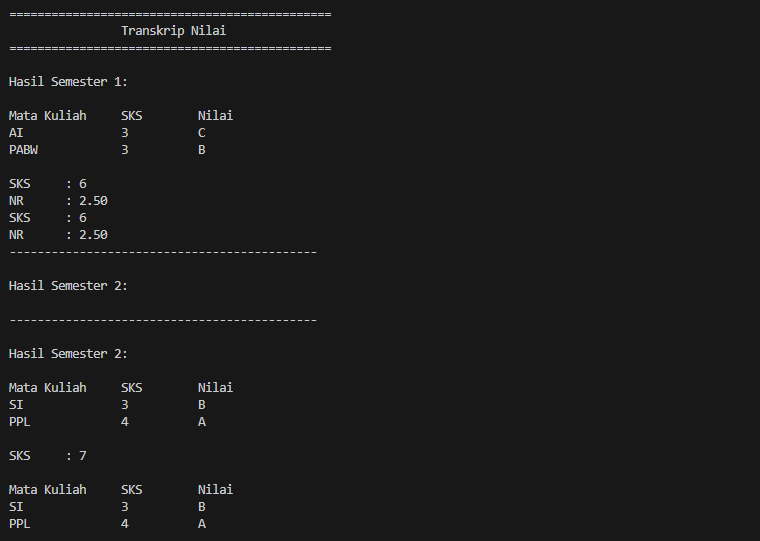
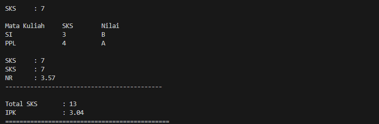