**# LAPORAN PERTEMUAN 4 - DART BAGIAN 3**

NAMA  : ANDREAS GALE DWI JAYA

KELAS : SIB - 3D

NIM   : 2241760033

**Praktikum 1: Eksperimen Tipe Data List**

Langkah 1 : Ketik atau salin kode program berikut ke dalam void main().

    var list = [1, 2, 3];
    assert(list.length == 3);
    assert(list[1] == 2);
    print(list.length);
    print(list[1]);

    list[1] = 1;
    assert(list[1] == 1);
    print(list[1]);

Langkah 2 : Silakan coba eksekusi (Run) kode pada langkah 1 tersebut. Apa yang terjadi? Jelaskan!

Jawab : 

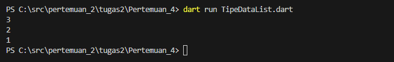

Langkah 3 : Ubah kode pada langkah 1 menjadi variabel final yang mempunyai index = 5 dengan default value = null. Isilah nama dan NIM Anda pada elemen index ke-1 dan ke-2. Lalu print dan capture hasilnya.
Apa yang terjadi ? Jika terjadi error, silakan perbaiki.

Jawab : 

Kode Program yang Dimodifikasi :

Hasil nya :

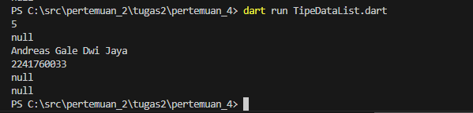

Penjelasannya : Pada kode program diatas menampilkan 5 elemen index dengan index 1 berisi nama saya yaitu Andreas Gale Dwi Jaya, dan index 2 berisi nim saya yaitu 2241760033, dan untuk index 0, 3, dan 4 berisi null

**Praktikum 2: Eksperimen Tipe Data Set**

Langkah 1 : Ketik atau salin kode program berikut ke dalam fungsi main().

    var halogens = {'fluorine', 'chlorine', 'bromine', 'iodine', 'astatine'};
    print(halogens);

Langkah 2 : Silakan coba eksekusi (Run) kode pada langkah 1 tersebut. Apa yang terjadi? Jelaskan! Lalu perbaiki jika terjadi error.

Jawab : 

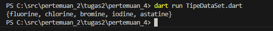

Dari program di atas tidak terjadi error dan akan menampilkan semua elemen yang ada dalam set.

Langkah 3 : Tambahkan kode program berikut, lalu coba eksekusi (Run) kode Anda.

    var names1 = <String>{};
    Set<String> names2 = {}; // This works, too.
    var names3 = {}; // Creates a map, not a set.

    print(names1);
    print(names2);
    print(names3);

Apa yang terjadi ? Jika terjadi error, silakan perbaiki namun tetap menggunakan ketiga variabel tersebut. Tambahkan elemen nama dan NIM Anda pada kedua variabel Set tersebut dengan dua fungsi berbeda yaitu .add() dan .addAll(). Untuk variabel Map dihapus, nanti kita coba di praktikum selanjutnya.

Jawab : 

Kode Program yang Dimodifikasi :

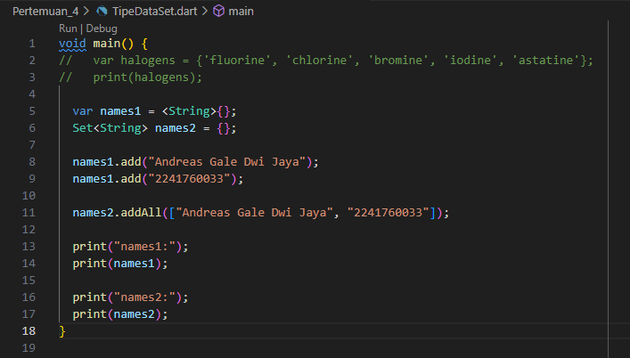

Hasil nya :

Penjelasannya : 
names1: Mencetak {Andreas Gale Dwi Jaya, 2241760033} karena kedua elemen ditambahkan ke dalam set names1 menggunakan metode .add().

names2: Mencetak {Andreas Gale Dwi Jaya, 2241760033} karena kedua elemen ditambahkan ke dalam set names2 menggunakan metode .addAll().

**Praktikum 3: Eksperimen Tipe Data Maps**

Langkah 1 : Ketik atau salin kode program berikut ke dalam void main().

    var gifts = {
    // Key:    Value
    'first': 'partridge',
    'second': 'turtledoves',
    'fifth': 1
    };

    var nobleGases = {
    2: 'helium',
    10: 'neon',
    18: 2,
    };

    print(gifts);
    print(nobleGases);

Langkah 2 : Silakan coba eksekusi (Run) kode pada langkah 1 tersebut. Apa yang terjadi? Jelaskan!

Jawab : Program diatas setelah dijalankan akan menampikan format yang dicetak dalam gifts dan noblegases.

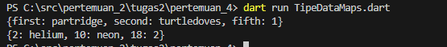

Langkah 3 : Tambahkan kode program berikut, lalu coba eksekusi (Run) kode Anda.

    var mhs1 = Map<String, String>();
    gifts['first'] = 'partridge';
    gifts['second'] = 'turtledoves';
    gifts['fifth'] = 'golden rings';

    var mhs2 = Map<int, String>();
    nobleGases[2] = 'helium';
    nobleGases[10] = 'neon';
    nobleGases[18] = 'argon';

Apa yang terjadi ? Jika terjadi error, silakan perbaiki.

Jawab : Hasilnya sama, akan terjadi error saat program dart dijalankan. karena variabel gifts dan nobleGases tidak dideklarasikan dan penggunaan variabel tidak konsisten (mhs1 dan mhs2)

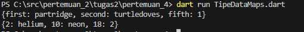

Tambahkan elemen nama dan NIM Anda pada tiap variabel di atas (gifts, nobleGases, mhs1, dan mhs2). Dokumentasikan hasilnya dan buat laporannya!

Jawab : 

Kode Program yang diModifikasi ditambahkan Nama dan Nim :

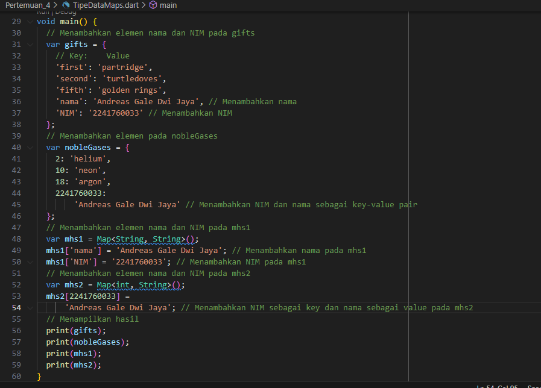

Hasilnya :

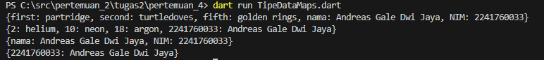

**Praktikum 4: Eksperimen Tipe Data List: Spread dan Control-flow Operators**

Langkah 1 : Ketik atau salin kode program berikut ke dalam fungsi main().

    var list = [1, 2, 3];
    var list2 = [0, ...list];
    print(list1);
    print(list2);
    print(list2.length);

Langkah 2 : Silakan coba eksekusi (Run) kode pada langkah 1 tersebut. Apa yang terjadi? Jelaskan! Lalu perbaiki jika terjadi error.

Jawab : Akan terjadi error saat program dart dijalankan, karena list1 tidak dideklarasikan. list1 diganti dengan list jika ingin mencetak nilai dari list

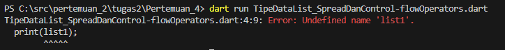

Hasil setelah diperbaiki :
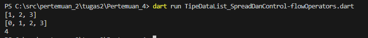

Langkah 3 : Tambahkan kode program berikut, lalu coba eksekusi (Run) kode Anda.

    list1 = [1, 2, null];
    print(list1);
    var list3 = [0, ...?list1];
    print(list3.length);

Apa yang terjadi ? Jika terjadi error, silakan perbaiki.
Tambahkan variabel list berisi NIM Anda menggunakan Spread Operators. Dokumentasikan hasilnya dan buat laporannya!

Jawab : list1 dicetak seperti yang dideklarasikan, yaitu [1, 2, null]. list3 menambahkan elemen 0 dan semua elemen dari list1, termasuk nilai null, sehingga panjangnya adalah 4.

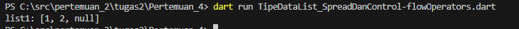

Hasil modifikasi berisi NIM :
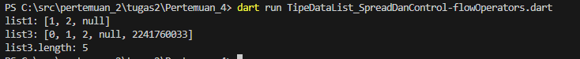

Penjabaran : list1 berisi [1, 2, null]. list3 berisi [0, 1, 2, null, 2241760069] yang merupakan gabungan dari elemen awal, list1, dan nimList. Panjang list3 adalah 5, karena ada lima elemen dalam list tersebut.

Langkah 4 : Tambahkan kode program berikut, lalu coba eksekusi (Run) kode Anda.

    var nav = ['Home', 'Furniture', 'Plants', if (promoActive) 'Outlet'];
    print(nav);

Apa yang terjadi ? Jika terjadi error, silakan perbaiki. Tunjukkan hasilnya jika variabel promoActive ketika true dan false.

Jawab : Akan terjadi error karena variabel promoActive tidak memiliki nilai

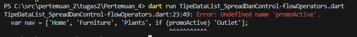

Hasil setelah diperbaiki jika variabel promoActive true:
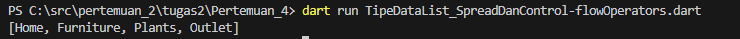

Hasil setelah diperbaiki jika variabel promoActive false:
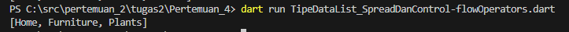

Penjabaran : Jika promoActive adalah true, elemen 'Outlet' ditambahkan; jika false, elemen tersebut tidak ditambahkan. Kode ini bekerja tanpa masalah dan menghasilkan output yang sesuai berdasarkan nilai dari promoActive.

Langkah 5 : Tambahkan kode program berikut, lalu coba eksekusi (Run) kode Anda.

    var nav2 = ['Home', 'Furniture', 'Plants', if (login case 'Manager') 'Inventory'];
    print(nav2);

Apa yang terjadi ? Jika terjadi error, silakan perbaiki. Tunjukkan hasilnya jika variabel login mempunyai kondisi lain.
Jawab :

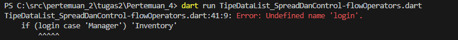

Hasil setelah diperbaiki :
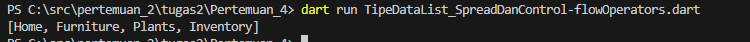

Hasil modifikasi kondisi lain :
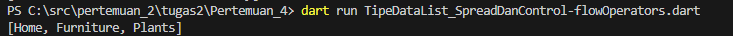

Penjabaran : Perbandingan yang benar digunakan untuk mengecek nilai dari login dan menambahkan 'Inventory' ke dalam list jika kondisi terpenuhi. List nav2 akan mencerminkan elemen 'Inventory' hanya jika login sama dengan 'Manager'. Jika tidak, list nav2 hanya berisi elemen lainnya.

Langkah 6 : Tambahkan kode program berikut, lalu coba eksekusi (Run) kode Anda.

    var listOfInts = [1, 2, 3];
    var listOfStrings = ['#0', for (var i in listOfInts) '#$i'];
    assert(listOfStrings[1] == '#1');
    print(listOfStrings);

Apa yang terjadi ? Jika terjadi error, silakan perbaiki. Jelaskan manfaat Collection For dan dokumentasikan hasilnya.

Jawab : 

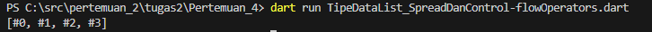

Penjabaran :listOfStrings dimulai dengan '#0'. Kemudian menggunakan ekspresi for (var i in listOfInts) '#$i' untuk menghasilkan '#1', '#2', dan '#3' dari elemen-elemen dalam listOfInts. Hasil akhir listOfStrings adalah ['#0', '#1', '#2', '#3']. Assert memeriksa bahwa elemen kedua adalah '#1', yang benar, jadi tidak ada error pada assert.

Manfaat Collection For:
- membuat list baru secara dinamis berdasarkan elemen dari list lain atau iterable
- interpolasi string langsung di dalam list, sehingga memudahkan pembuatan string yang terformat. -> membuat kode lebih ringkas dan mudah dibaca dibandingkan dengan loop eksplisit atau metode lain. -> Dapat digunakan dengan ekspresi kondisi tambahan untuk menyaring atau memodifikasi elemen saat membuat list baru.

**Praktikum 5 : Eksperimen Tipe Data Records**

Langkah 1 : Ketik atau salin kode program berikut ke dalam fungsi main().

    var record = ('first', a: 2, b: true, 'last');
    print(record)

Langkah 2 : Silakan coba eksekusi (Run) kode pada langkah 1 tersebut. Apa yang terjadi? Jelaskan! Lalu perbaiki jika terjadi error.

Jawab : Kode ini membuat sebuah record yang menggunakan sintaks tuple-like dengan penamaan parameter dan posisional argument.

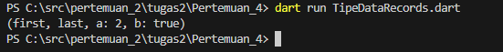

Langkah 3 : Tambahkan kode program berikut di luar scope void main(), lalu coba eksekusi (Run) kode Anda.

    (int, int) tukar((int, int) record) {
        var (a, b) = record;
        return (b, a);
    }

Apa yang terjadi ? Jika terjadi error, silakan perbaiki. Gunakan fungsi tukar() di dalam main() sehingga tampak jelas proses pertukaran value field di dalam Records.

Jawab : Program akan error saat dijalankan karena tidak ada fungsi main didalam program. Fungsi main adalah titik awal dari eksekusi program Dart. Tanpa fungsi main, Dart tidak tahu dari mana harus memulai eksekusi.

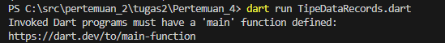

Hasil setelah diperbaiki :

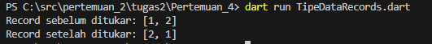

Penjabaran : diperbaiki menggunakan List untuk meniru fungsionalitas tuple. Fungsi tukar yang mendukung List berfungsi dengan baik untuk menukar nilai dan dapat digunakan di dalam main() untuk memverifikasi hasil pertukaran nilai di dalam records.

Langkah 4 : Tambahkan kode program berikut di dalam scope void main(), lalu coba eksekusi (Run) kode Anda.

    // Record type annotation in a variable declaration:
    (String, int) mahasiswa;
    print(mahasiswa);

Apa yang terjadi ? Jika terjadi error, silakan perbaiki. Inisialisasi field nama dan NIM Anda pada variabel record mahasiswa di atas. Dokumentasikan hasilnya dan buat laporannya!

Jawab :  Akan terjadi error karena Dart tidak mengenali tipe tuple dalam konteks deklarasi variabel seperti (String, int) secara langsung.

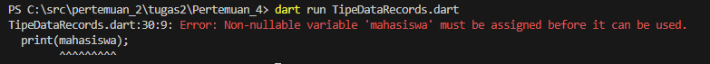

Hasil setelah diperbaiki :

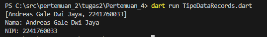

Penjabaran : mendeklarasikan dan menginisialisasi sebuah List bernama mahasiswa yang menyimpan data berupa nama dan NIM. Data ini kemudian dicetak secara keseluruhan serta dipisahkan untuk nama dan NIM.

Langkah 5 : Tambahkan kode program berikut, lalu coba eksekusi (Run) kode Anda.

    var mahasiswa2 = ('first', a: 2, b: true, 'last');

    print(mahasiswa2.$1); // Prints 'first'
    print(mahasiswa2.a); // Prints 2
    print(mahasiswa2.b); // Prints true
    print(mahasiswa2.$2); // Prints 'last'

Apa yang terjadi ? Jika terjadi error, silakan perbaiki. Gantilah salah satu isi record dengan nama dan NIM Anda, lalu dokumentasikan hasilnya dan buat laporannya!

Jawab :

Program di atas akan menampilakan nilai nilai yang didefinisikan secara beruntun dengan nama parameter

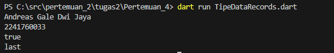

**TUGAS PRAKTIKUM**
1. Silakan selesaikan Praktikum 1 sampai 5, lalu dokumentasikan berupa screenshot hasil pekerjaan Anda beserta penjelasannya!

Jawab : sudah diatas

2. Jelaskan yang dimaksud Functions dalam bahasa Dart!

Jawab : functions adalah blok kode yang dapat dipanggil untuk melakukan tugas tertentu.misalnya menerima parameter, menjalankan logika tertentu, dan mengembalikan nilai.

3. Jelaskan jenis-jenis parameter di Functions beserta contoh sintaksnya!

Jawab :
Parameter Posisi (Positional Parameters): Parameter yang didefinisikan dalam urutan tertentu dan harus diberikan saat fungsi dipanggil.

    void printInfo(String name, int age) {
    print('Name: $name, Age: $age');
    }

Parameter Default (Default Parameters): Parameter yang memiliki nilai default jika tidak diberikan nilai saat fungsi dipanggil.

    void greet(String name, [String greeting = 'Hello']) {
    print('$greeting, $name!');
    }
Name Parameters: Parameter yang dapat disebutkan secara eksplisit dengan nama saat fungsi dipanggil. Dapat bersifat wajib atau opsional.

    void printDetails({required String name, int? age}) {
    print('Name: $name, Age: $age');
    }

4. Jelaskan maksud Functions sebagai first-class objects beserta contoh sintaknya!

Jawab : Dalam Dart, fungsi dianggap sebagai first-class objects. Ini berarti fungsi dapat:

Disimpan dalam variabel
Dikirim sebagai argumen ke fungsi lain
Dapat dikembalikan dari fungsi lain  

Dalam Dart, fungsi dianggap sebagai first-class objects. Ini berarti fungsi dapat:

  Disimpan dalam variabel
  Dikirim sebagai argumen ke fungsi lain
  Dapat dikembalikan dari fungsi lain  

          void main() {
          // Menyimpan fungsi dalam variabel
          Function greet = (String name) {
          print('Hello, $name!');
          };
          
          // Menggunakan fungsi
          greet('Anas'); // Prints: Hello, Anas!
          
          // Mengirim fungsi sebagai argumen
          void execute(Function action) {
          action('Alice');
          }
          
          execute(greet); // Prints: Hello, Alice!
          }

5. Apa itu Anonymous Functions? Jelaskan dan berikan contohnya!

Jawab : Anonymous functions adalah fungsi yang tidak memiliki nama. Biasanya digunakan untuk fungsi singkat yang hanya digunakan sekali atau di dalam konteks tertentu.

    void main() {
        // Anonymous function yang dipanggil langsung
        var numbers = [1, 2, 3];
        numbers.forEach((number) {
        print(number * 2);
        });
    }

6. Jelaskan perbedaan Lexical scope dan Lexical closures! Berikan contohnya!

Jawab :
- Lexical Scope: Menyatakan bahwa variabel yang dideklarasikan di dalam fungsi dapat diakses oleh fungsi atau blok yang terletak di dalam lingkup yang sama. Variabel lokal hanya dapat diakses di dalam fungsi atau blok tempat ia dideklarasikan.

          void main() {
          int a = 10;
          
          void innerFunction() {
          print(a); // a diakses dalam scope innerFunction
          }
          
          innerFunction(); // Prints: 10
          }  
- Lexical Closures: untuk "menutup" lingkup variabel yang dideklarasikan di luar fungsi tersebut. dapat mengakses variabel dari lingkup yang lebih luas di mana fungsi tersebut didefinisikan, bahkan setelah lingkup tersebut selesai.

          Function makeCounter() {
          int count = 0;
          
          return () {
          count++;
          return count;
          };
          }

          void main() {
          var counter = makeCounter();
          print(counter()); // Prints: 1
          print(counter()); // Prints: 2
          }

7. Jelaskan dengan contoh cara membuat return multiple value di Functions!

Jawab : Dalam Dart, kita dapat mengembalikan beberapa nilai dari sebuah fungsi dengan menggunakan tipe data seperti List, Map, atau Record jika tersedia.

- Contoh Mengembalikan Beberapa Nilai dengan List: List getMinMax(List numbers) { int min = numbers.reduce((a, b) => a < b ? a : b); int max = numbers.reduce((a, b) => a > b ? a : b); return [min, max]; }

          void main() {
          var result = getMinMax([3, 5, 1, 9, 2]);
          print('Min: ${result[0]}, Max: ${result[1]}'); // Prints: Min: 1, Max: 9
          }   
- Contoh Mengembalikan Beberapa Nilai dengan Map: Map<String, int> getMinMax(List numbers) { int min = numbers.reduce((a, b) => a < b ? a : b); int max = numbers.reduce((a, b) => a > b ? a : b); return {'min': min, 'max': max}; }

          void main() {
          var result = getMinMax([3, 5, 1, 9, 2]);
          print('Min: ${result['min']}, Max: ${result['max']}'); // Prints: Min: 1, Max: 9
          }

8. Kumpulkan berupa link commit repo GitHub pada tautan yang telah disediakan di grup Telegram!

Jawab : sudah
